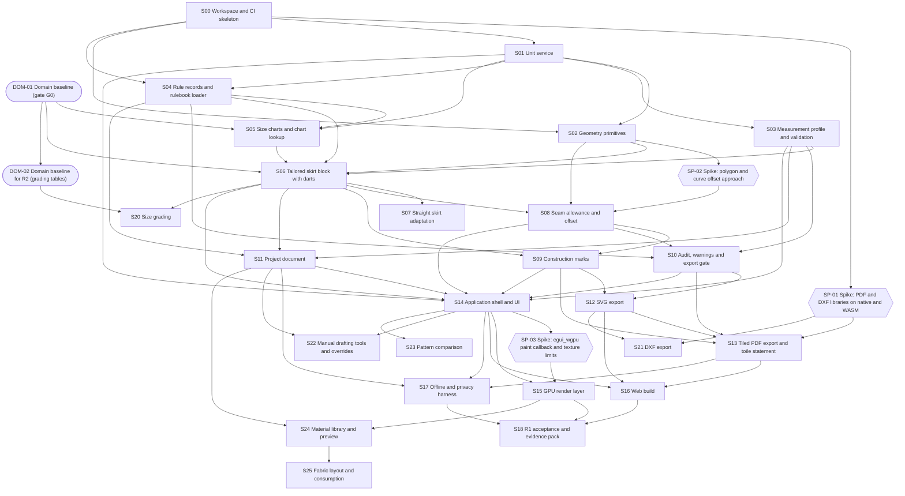

# Dependency graph and build order

Hexagons are spikes. Rounded boxes are domain work done by people, not code.

## One valid build order

| Step | Slice | Release | Kind | Name |
|---|---|---|---|---|
| 1 | DOM-01 | R1 | domain | Domain baseline (gate G0) |
| 2 | S00 | R1 | code | Workspace and CI skeleton |
| 3 | SP-01 | R1 | spike | Spike: PDF and DXF libraries on native and WASM |
| 4 | S01 | R1 | code | Unit service |
| 5 | S02 | R1 | code | Geometry primitives |
| 6 | SP-02 | R1 | spike | Spike: polygon and curve offset approach |
| 7 | S03 | R1 | code | Measurement profile and validation |
| 8 | S04 | R1 | code | Rule records and rulebook loader |
| 9 | S05 | R1 | code | Size charts and chart lookup |
| 10 | S06 | R1 | code | Tailored skirt block with darts |
| 11 | S08 | R1 | code | Seam allowance and offset |
| 12 | S09 | R1 | code | Construction marks |
| 13 | S10 | R1 | code | Audit, warnings and export gate |
| 14 | S11 | R1 | code | Project document |
| 15 | S14 | R1 | code | Application shell and UI |
| 16 | SP-03 | R1 | spike | Spike: egui_wgpu paint callback and texture limits |
| 17 | S07 | R1 | code | Straight skirt adaptation |
| 18 | S12 | R1 | code | SVG export |
| 19 | S13 | R1 | code | Tiled PDF export and toile statement |
| 20 | S15 | R1 | code | GPU render layer |
| 21 | S16 | R1 | code | Web build |
| 22 | S17 | R1 | code | Offline and privacy harness |
| 23 | S18 | R1 | code | R1 acceptance and evidence pack |
| 24 | DOM-02 | R2 | domain | Domain baseline for R2 (grading tables) |
| 25 | S20 | R2 | code | Size grading |
| 26 | S21 | R2 | code | DXF export |
| 27 | S22 | R2 | code | Manual drafting tools and overrides |
| 28 | S23 | R2 | code | Pattern comparison |
| 29 | S24 | R2 | code | Material library and preview |
| 30 | S25 | R2 | code | Fabric layout and consumption |

## Parallel tracks

- DOM-01 (people) runs in parallel with S00 to S04. It must finish before S05, S06 and S07 can be completed.
- S01 and S02 can proceed in parallel after S00. SP-01 and SP-02 can run as soon as their dependencies finish.
- S03 and S04 can proceed in parallel after S01.

## Critical path

DOM-01 then S05, S06, S07, S08 (needs SP-02), S09, S10, S12, S13 (needs SP-01), S14, S15, S16, S17, S18. The longest human-dependent step is DOM-01, because it needs a named pattern maker (OQ-10).
